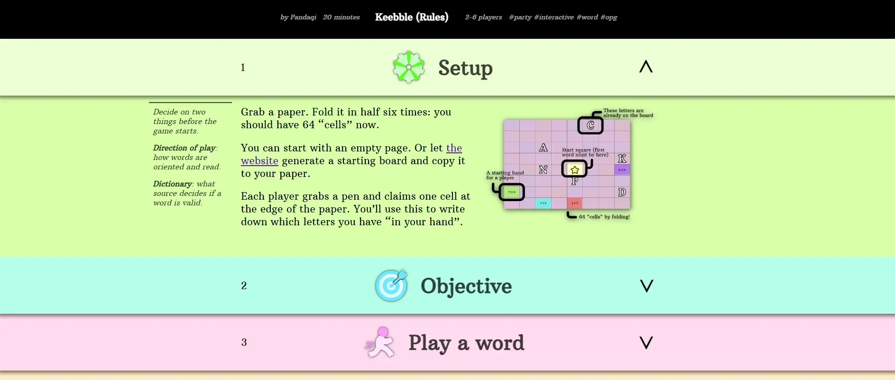

# PQ Rulebook

At the start of 2023, I started creating "playful rules" for my (board) game at [Pandaqi](https://pandaqi.com). This repository contains the code and assets used to power that system.

It's finished---I've actually used it for some time---but highly tailored to my website and still quite limited.

## What does it do?

It turns a website into an _interactive rulebook_, because that's by far the best and most fun way to learn a new game.

* Chop a rulebook into sections that can fold/unfold
* It automatically numbers these sections, unfolds + jumps to one if you click a reference to another section, allows adding an icon/graphic to them, etcetera
* Create "rules tables": a table with images of elements in the game (e.g. powerups or tiles), when clicked it gives you the explanation for it.
* Support "remarks": things you want in the side margin or that are clearly less important than the main body of rules
* Many different ways to add images: regular, next to text, as a carousel of multiple images. All images can be clicked to view in fullscreen.
* Support "interactive examples": you click a button
* A toggle that switches to "PDF" mode: now you can visit the rules in a (modern) browser, press CTRL+P, and get a printable version of the rulebook. 

It only supports sections and subsections, no further hierarchy. Why? Because you might think you need it, but you don't :p Nesting further than that makes _anything_ way too complicated and unstructured, especially rulebooks.

## How does it work?

I've included an example rulebook (the first one I created with this system).

It's integrated with the Hugo static site generator. 

* The file `rules/list.html` is used to display the rulebook.
* The shortcodes inside `shortcodes` can be used freely to mark up the document. (Each section is inside a `rules-block`. So, to add a subsection, add a `rules-block` inside another `rules-block`.)

You can use it anywhere else by simply supplying the same HTML in a different way.

The file `style-rules.scss` defines basic styles for the rulebook. (Each specific rulebook will add its own styles in a separate file, as you usually don't want all games to look the same.)

Finally, include `lib-pqRulebook.min.js` on the page and it will automatically create all this functionality (if your HTML has the right classes/general structure). 

You can see the individual, unminified modules in `js/pq_rulebook`. These are bundled and built automatically by Hugo on my system.

Fun fact: I didn't know Hugo could do that until recently. It made life _so much easier_ and almost all my JS libraries shrunk in size by 50%. Yes, I am stupid sometimes.

## Section Icons

The icons for sections can be one of 8 predefined types (that occur in almost every rulebook). (These are grayscale, so they can be tinted to fit any design.)

* setup (anything that needs to happen before the game starts)
* objective (when the game ends and who wins)
* gameplay (the general structure, such as who starts, rounds, turn structure, ...)
* action (the thing(s) you'll actually do)
* scoring (how scoring / progressing towards the objective works)
* expansion (the list of expansions or variants)
* options (simply a list of all options, such as all cards that can appear and what they do)
* beware (a reminder, warning, crucial rule that needs to stand out)

## Interactive Examples

To register a new example, use the `rules-example` shortcode with some unique `id="something"`. Then, in an extra javascript file (which you also load), define what this example does.

Set `PQ_RULEBOOK.exampleConfigs[id] = ` to some object that contains the `generate(o)` function. 

* This function is called by the system to generate a new example turn. 
* The `o` contains many helper functions (from the library) to easily create interactive examples.

Again, see the example rulebook(s) for how this works in practice.

## Roadmap

I improve this system whenever I create a new rulebook (and/or need some new functionality). In general, I want ...

* Way better documentation, generalized code, so others can use it as well
* To research how to prevent all these rulebooks from looking the same.
* Easy support for animations / videos
* More tools for the interactive examples (once I've made enough to see patterns and what functionality is most needed)